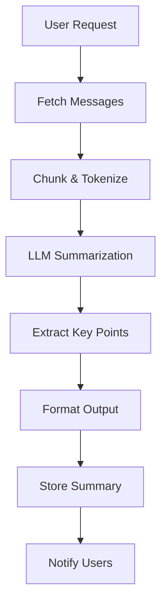

# AI Agents for Real-Time Collaboration Tool

## Overview

This document outlines the AI agent architecture and capabilities that can be integrated into the Real-Time Collaboration Tool. Currently, the application is a traditional WebSocket-based chat system. This document serves as a roadmap for adding intelligent agent capabilities to enhance user experience and collaboration.

## Current State

**Status:** No AI agents currently implemented

**Baseline Architecture:**

- Real-time messaging via Socket.io
- PostgreSQL for message persistence
- Redis for caching and pub/sub
- NestJS backend with REST API
- React frontend

## Proposed Agent Architecture

### Agent Integration Pattern

```
┌───────────────────────────────────────────────────────────────┐
│                     User Interface Layer                      │
│                    (React Frontend)                           │
└───────────────────────────┬───────────────────────────────────┘
                            │
┌───────────────────────────┴───────────────────────────────────┐
│                    Agent Orchestrator                         │
│              (Routing & Request Management)                   │
└─────┬──────────┬──────────┬──────────┬──────────┬─────────────┘
      │          │          │          │          │
      ▼          ▼          ▼          ▼          ▼
┌──────────┐ ┌──────────┐ ┌──────────┐ ┌───────────┐ ┌─────────┐
│Moderation│ │Summary   │ │Assistant │ │Translation│ │ Search  │
│  Agent   │ │  Agent   │ │  Agent   │ │   Agent   │ │  Agent  │
└──────────┘ └──────────┘ └──────────┘ └───────────┘ └─────────┘
      │          │          │          │          │
      └──────────┴──────────┴──────────┴──────────┘
                            │
┌───────────────────────────┴───────────────────────────────────┐
│                    LLM Provider Layer                         │
│           (OpenAI, Anthropic, Local Models)                   │
└───────────────────────────────────────────────────────────────┘
```

## Agent Catalog

### 1. Moderation Agent

**Purpose:** Ensure safe and respectful communication within chat rooms

**Capabilities:**

- Content filtering and profanity detection
- Spam and abuse detection
- Inappropriate content flagging
- Rule violation detection
- Auto-moderation actions

**Tools:**

- `analyzeMessage(content: string): ModerationResult`
- `flagContent(messageId: string, reason: string): void`
- `autoModerate(messageId: string, action: ModerationType): void`

**Configuration:**

```typescript
interface ModerationConfig {
  enabled: boolean;
  autoModerate: boolean;
  sensitivity: 'low' | 'medium' | 'high';
  blockedWords: string[];
  allowedDomains: string[];
  maxMessagesPerMinute: number;
}
```

**Integration Points:**

- Pre-message send validation
- Real-time message analysis
- User warning system
- Admin notification system

**Expected Behavior:**

1. Analyze every message before storage
2. Flag problematic content
3. Optional auto-blocking for severe violations
4. Log moderation events for review

---

### 2. Summarization Agent

**Purpose:** Generate intelligent summaries of conversations and meetings

**Capabilities:**

- Room conversation summarization
- Meeting notes generation
- Key points extraction
- Action items identification
- Topic clustering

**Tools:**

- `summarizeRoom(roomId: string, timeRange: TimeRange): Summary`
- `extractKeyPoints(messages: Message[]): KeyPoint[]`
- `identifyActionItems(summary: string): ActionItem[]`
- `generateMeetingNotes(roomId: string, format: 'markdown' | 'json'): string`

**Configuration:**

```typescript
interface SummaryConfig {
  enabled: boolean;
  autoSummarize: boolean;
  summaryTrigger: 'time' | 'messageCount' | 'manual';
  minMessages: number;
  maxTokens: number;
  includeActionItems: boolean;
}
```

**Integration Points:**

- Manual `/summarize` command
- Scheduled daily summaries
- On-demand summary generation
- Email digest integration

**Workflow:**



---

### 3. Assistant Agent

**Purpose:** Provide intelligent assistance and context-aware suggestions

**Capabilities:**

- Answer questions about room context
- Provide helpful suggestions
- Code snippet assistance
- Link and resource recommendations
- Smart auto-completion
- Context-aware responses

**Tools:**

- `answerQuestion(question: string, context: Message[]): Answer`
- `suggestResponse(context: Message[]): string[]`
- `explainCode(code: string, language: string): Explanation`
- `findResources(query: string): Resource[]`

**Configuration:**

```typescript
interface AssistantConfig {
  enabled: boolean;
  triggerPrefix: string; // e.g., "@assistant"
  contextWindow: number; // number of messages to include
  suggestionsEnabled: boolean;
  codeAssistanceEnabled: boolean;
  maxResponseLength: number;
}
```

**Integration Points:**

- `@assistant` mention trigger
- `/ask <question>` command
- Smart suggestions panel
- Code block explanations

**Example Usage:**

```
User: @assistant What have we discussed about the deployment strategy?
Assistant: Based on the last 50 messages, the team has discussed:
1. Moving to Kubernetes for orchestration
2. Using blue-green deployment strategy
3. Setting up staging environment first
4. Timeline: 2 weeks for initial setup
```

---

### 4. Translation Agent

**Purpose:** Enable multilingual communication in real-time

**Capabilities:**

- Real-time message translation
- Multi-language support (50+ languages)
- Automatic language detection
- Preserve formatting and emoji
- Cultural context awareness

**Tools:**

- `translateMessage(content: string, targetLang: string): string`
- `detectLanguage(content: string): Language`
- `batchTranslate(messages: Message[], targetLang: string): Message[]`
- `getAvailableLanguages(): Language[]`

**Configuration:**

```typescript
interface TranslationConfig {
  enabled: boolean;
  autoTranslate: boolean;
  defaultLanguage: string;
  preserveOriginal: boolean;
  supportedLanguages: string[];
  showOriginalOnHover: boolean;
}
```

**Integration Points:**

- Real-time message translation
- User language preferences
- Toggle translation per room
- Translation history

**UI Features:**

- Language selector per user
- "Translate" button on messages
- Show original/translated toggle
- Language indicator badges

---

### 5. Search Agent

**Purpose:** Intelligent semantic search across conversations

**Capabilities:**

- Semantic message search
- Context-aware results
- Fuzzy matching
- Time-based filtering
- User-specific searches
- Topic-based search

**Tools:**

- `semanticSearch(query: string, roomId?: string): SearchResult[]`
- `findSimilar(messageId: string): Message[]`
- `searchByTopic(topic: string): Message[]`
- `searchByUser(username: string, query: string): Message[]`

**Configuration:**

```typescript
interface SearchConfig {
  enabled: boolean;
  indexingEnabled: boolean;
  semanticSearch: boolean;
  maxResults: number;
  relevanceThreshold: number;
  includeContext: boolean;
  highlightMatches: boolean;
}
```

**Integration Points:**

- Search bar in UI
- `/search <query>` command
- Related messages sidebar
- Search history

**Backend Requirements:**

- Vector embeddings for messages
- Vector database (pgvector) integration
- Periodic re-indexing
- Real-time index updates

---

### 6. Analytics Agent

**Purpose:** Provide insights and analytics on conversation patterns

**Capabilities:**

- Sentiment analysis
- Topic detection and clustering
- Engagement metrics
- User participation analysis
- Trend identification
- Meeting effectiveness scoring

**Tools:**

- `analyzeSentiment(messages: Message[]): SentimentScore`
- `detectTopics(roomId: string, timeRange: TimeRange): Topic[]`
- `getUserEngagement(username: string): EngagementMetrics`
- `identifyTrends(roomId: string): Trend[]`

**Configuration:**

```typescript
interface AnalyticsConfig {
  enabled: boolean;
  realTimeAnalysis: boolean;
  sentimentAnalysis: boolean;
  topicDetection: boolean;
  engagementTracking: boolean;
  reportingInterval: 'daily' | 'weekly' | 'monthly';
}
```

**Integration Points:**

- Admin dashboard
- Room analytics view
- User insights panel
- Email reports

**Metrics Tracked:**

- Messages per hour/day
- Active users
- Response times
- Sentiment trends
- Topic distribution
- Peak activity times

---

## Agent Communication Patterns

### 1. Request-Response Pattern

```typescript
// User sends message
→ Moderation Agent validates
→ Message stored
→ Message broadcast
→ Analytics Agent processes (async)
```

### 2. Event-Driven Pattern

```typescript
// On room join
→ Search Agent indexes recent messages
→ Summary Agent checks if summary needed
→ Assistant Agent loads context

// On message send
→ Translation Agent translates (if enabled)
→ Moderation Agent scans
→ Analytics Agent updates metrics
```

### 3. Orchestrator Pattern

```typescript
// User command: "/help with deployment"
→ Agent Orchestrator receives request
→ Routes to Assistant Agent
→ Assistant Agent queries Search Agent for context
→ Generates response with context
→ Returns to user
```

## Implementation Roadmap

### Phase 1: Foundation (Weeks 1-2)

- [ ] Design agent architecture
- [ ] Set up LLM provider integration
- [ ] Implement Agent Orchestrator service
- [ ] Create base Agent interface

### Phase 2: Core Agents (Weeks 3-6)

- [ ] Implement Moderation Agent
- [ ] Implement Search Agent (basic)
- [ ] Add `/command` handler system
- [ ] Create agent configuration system

### Phase 3: Advanced Features (Weeks 7-10)

- [ ] Implement Summarization Agent
- [ ] Implement Assistant Agent
- [ ] Add vector database for semantic search
- [ ] Create analytics dashboard

### Phase 4: Enhancement (Weeks 11-12)

- [ ] Implement Translation Agent
- [ ] Implement Analytics Agent
- [ ] Add user preferences for agents
- [ ] Performance optimization

## Configuration Management

### Global Agent Configuration

```typescript
// config/agents.config.ts
export const agentConfig = {
  enabled: true,
  provider: 'anthropic', // or 'openai', 'local'
  model: 'claude-sonnet-4',
  apiKey: process.env.LLM_API_KEY,
  maxConcurrentRequests: 10,
  timeout: 30000,
  retryAttempts: 3,
  
  agents: {
    moderation: { /* ModerationConfig */ },
    summarization: { /* SummaryConfig */ },
    assistant: { /* AssistantConfig */ },
    translation: { /* TranslationConfig */ },
    search: { /* SearchConfig */ },
    analytics: { /* AnalyticsConfig */ }
  }
};
```

### Per-Room Agent Settings

```typescript
interface RoomAgentSettings {
  roomId: string;
  enabledAgents: string[];
  moderationLevel: 'strict' | 'moderate' | 'relaxed';
  autoSummarize: boolean;
  translationEnabled: boolean;
  defaultLanguage: string;
}
```

## Security Considerations

### Data Privacy

- No message content stored in external LLM logs
- User data anonymization for analytics
- Opt-in for AI features per user
- GDPR compliance for data processing

### Rate Limiting

- Per-user rate limits for agent requests
- Per-room rate limits for batch operations
- Circuit breaker for LLM API failures

### Access Control

- Agent admin permissions
- Per-room agent enable/disable
- User-level agent access control

## Monitoring & Observability

### Metrics to Track

- Agent response times
- LLM token usage
- Error rates per agent
- Agent usage patterns
- Cost per agent per room

### Logging

```typescript
interface AgentLog {
  timestamp: Date;
  agentType: string;
  action: string;
  roomId?: string;
  userId?: string;
  success: boolean;
  duration: number;
  tokensUsed?: number;
  error?: string;
}
```

## Cost Estimation

### Expected Monthly Costs (100 active users)

- **Moderation Agent**: ~$50-100 (high volume)
- **Summarization Agent**: ~$100-200 (daily summaries)
- **Assistant Agent**: ~$150-300 (medium usage)
- **Translation Agent**: ~$50-150 (per active translator)
- **Search Agent**: ~$100-200 (indexing + queries)
- **Analytics Agent**: ~$50-100 (batch processing)

**Total Estimated**: $500-1,050/month

### Cost Optimization Strategies

- Use smaller models for simple tasks (Haiku vs Sonnet)
- Cache frequent queries
- Batch processing where possible
- Rate limiting aggressive usage
- Local models for privacy-sensitive operations

## Testing Strategy

### Unit Tests

- Individual agent functions
- Tool implementations
- Configuration validation

### Integration Tests

- Agent orchestrator routing
- Multi-agent workflows
- Error handling and fallbacks

### E2E Tests

- User command flows
- Real-time agent interactions
- Performance under load

### Test Coverage Goals

- Unit tests: 80%+
- Integration tests: 70%+
- E2E tests: Key workflows

## Future Enhancements

### Advanced Features

- **Voice-to-Text Agent**: Transcribe voice messages
- **Image Analysis Agent**: Describe and analyze shared images
- **Calendar Agent**: Schedule meetings from conversation
- **Task Agent**: Extract and create tasks from discussions
- **Learning Agent**: Personalized assistance based on user patterns

### Multi-Agent Collaboration

- Agents working together on complex requests
- Agent-to-agent communication protocols
- Shared context and memory

### Personalization

- Per-user agent preferences
- Learning from user feedback
- Adaptive agent behavior

## Contributing

When adding new agents:

1. Create agent interface in `backend/src/agents/interfaces/`
2. Implement agent in `backend/src/agents/`
3. Register in Agent Orchestrator
4. Add configuration schema
5. Write tests
6. Update this documentation

## References

- [Anthropic's Building Effective Agents](https://www.anthropic.com/research/building-effective-agents)
- [LangChain Agent Documentation](https://python.langchain.com/docs/modules/agents/)
- [OpenAI Assistants API](https://platform.openai.com/docs/assistants/overview)

---

**Last Updated**: 2025-11-25  
**Version**: 1.0.0  
**Status**: Planning/Design Phase
